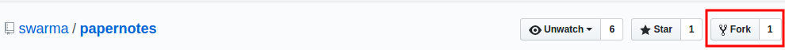
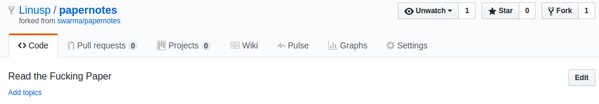
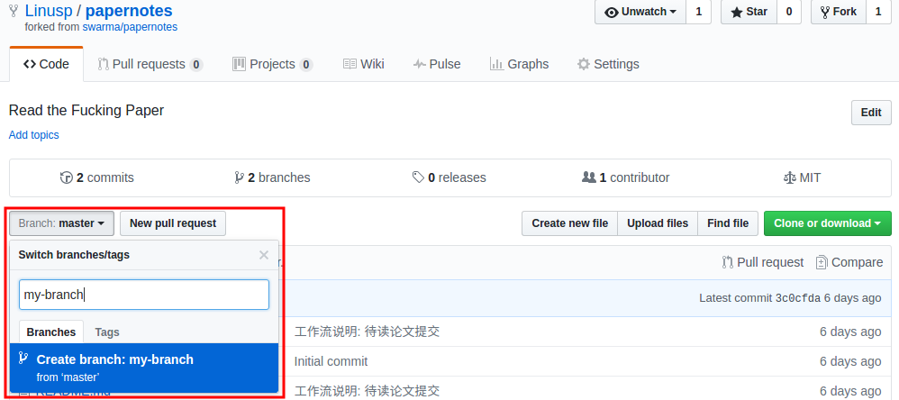
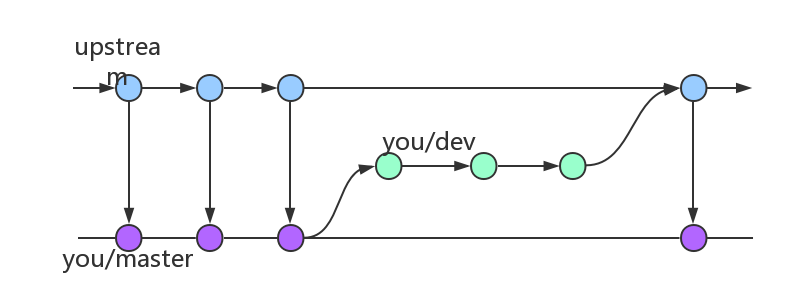
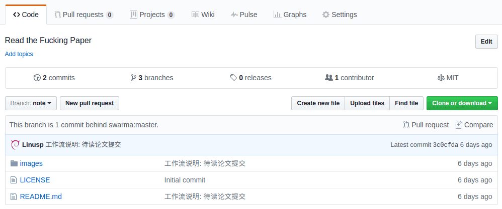

## 简介

本项目用于集智俱乐部成员分享和交流论文阅读心得，当然也欢迎其他朋友参与进来。

## 参与方式

注 1: 项目通过 Github 进行管理，如无 Github 帐号请先进行[注册](https://github.com/join)。

注 2: 熟悉 Git/Github 的朋友可以不用严格遵循下面的具体过程，按照 [Github Flow](https://guides.github.com/introduction/flow/) 参与即可。

1.  `fork` 项目到自己的帐号下面

    如下图所示，点击 `Fork` 按钮即可

    

    所谓 `fork` 将会复制当前项目 A 到自己的帐号下面产生项目 B，这时项目 A 就成为了项目 B 的上游项目，当项目 A 有更新时项目 B 可以方便地和项目 A 进行同步，同时也方面项目 B 中的更新提交给项目 A。如下图所示，在自己的 `fork` 过来的项目 `Linusp/papernotes` 下方会显示上游项目 `swarma/papernotes`

    

2.  创建新的分支

    如下图所示，输入一个新的分支名称来创建一个分支，分支的名称自定，比如说可以命名为 `dev` 或 `note`，并无强制规定。

    

    所谓的分支，直观来说，就是主干上一条偏离主干的路径。前面说了，下游项目需要和上游项目保持同步，在我们这个项目中就是如此，参与者在自己的项目中转写笔记、心得，然后统一提交到上游项目。为了和上游项目保持同步，在我们自己的项目中，需要有一个上游项目的复制体，随时保持着和上游的一致性，而我们不会对这个复制体进行我们自己的修改；但我们又要提交修改到上游，所以就可以在这个复制体上拉出一条暂时偏离的路径出来，修改好后再将这条路径接入上游项目 —— 这样就形成了一个不会阻塞的环状路径。如下图所示：

    

3.  (可选)提交待读论文

    在[上游项目](https://github.com/swarma/papernotes)的页面上，点击 Issue 来提交一篇新的待读论文，如下图所示：

    

    对提交的论文需按固定的格式给出简单的介绍，参见[待读论文提交示例](https://github.com/swarma/papernotes/issues/1)

    论文被提交后需等待审核，至少一位提交者以外的人确认通过后才可以被领取。

4.  (可选)审核待读论文

    在一篇待读论文被提交后，提交者以外的人可以对这篇待读论文进行评论、审核。如果认为这篇论文应该被通过，那么可以用 👍 对其进行标记；否则用 👎 对其进行标记。

    

    待读论文提交一定时间之后，如果 👍 数量不为 0 且比 👎 数量要多，那么就被认为审核通过。

5.  领取待读论文

    在一篇待读论文通过审核后，在对应的 Issue 页面简单评论，表明领取论文即可，先到先得。

    

    如果论文领取一定时间后，领取者没有提交笔记，其他人可以对其标记 👎，并自己领取这篇论文。

6.  TODO 同步上游项目

    blablabla

7.  撰写论文笔记

    在自己帐号的项目中，通过 Branch 下拉列表选择非 master 分支，然后创建一个新的文件，使用 markdown 来撰写笔记，完成后点击提交。

    

8.  TODO 提交论文笔记
