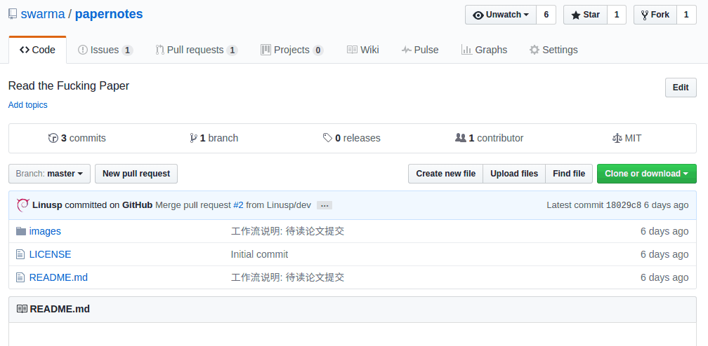
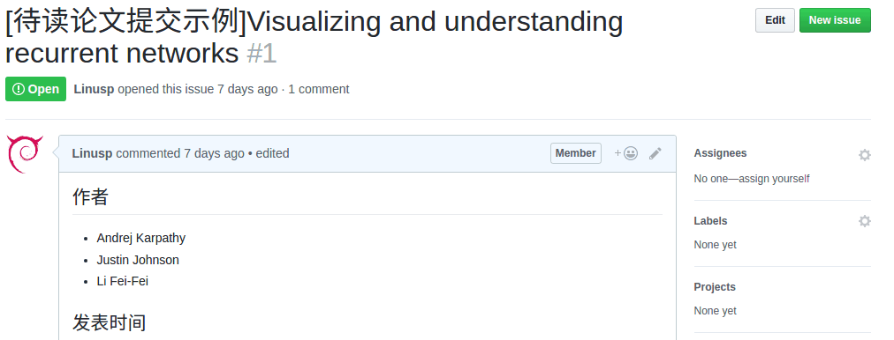
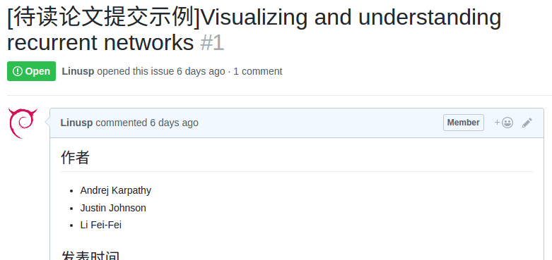
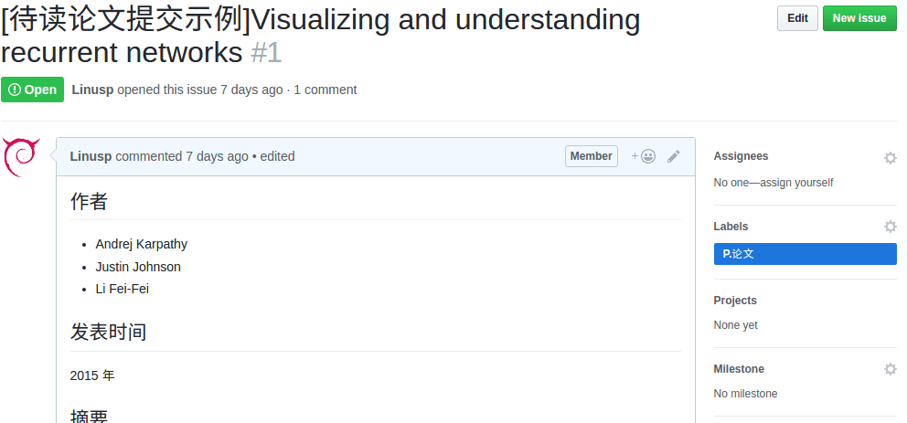
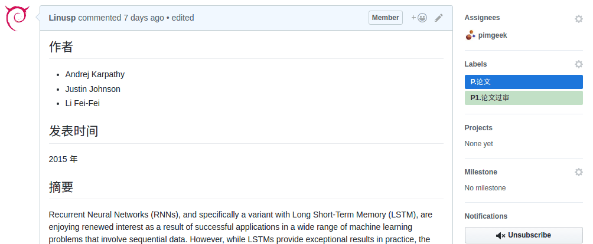
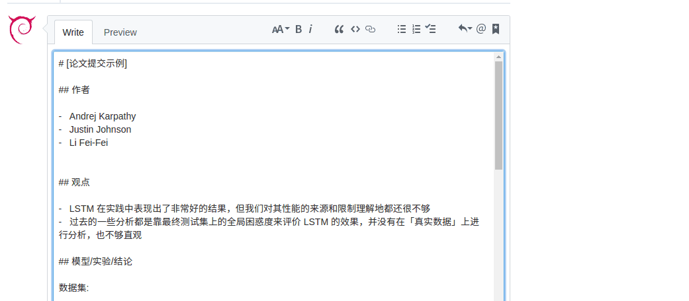

## 简介

本项目用于集智俱乐部成员分享和交流论文阅读心得，当然也欢迎其他朋友参与进来。

## 参与方式

### 加入论文阅读小组

1.  项目通过 Github 进行管理，如无 Github 帐号请先进行[注册](https://github.com/join)

2.  请联系管理者要求加入「论文阅读小组」

### 提交待读论文

在[项目首页](https://github.com/swarma/papernotes)的页面上，点击 Issue 来提交一篇新的待读论文，如下图所示：



对提交的论文需按固定的格式给出简单的介绍，参见[待读论文提交示例](https://github.com/swarma/papernotes/issues/1)

提交待读论文后，为了方便管理，请为其添加标签「P.论文」，如下图所示：



论文被提交后需等待审核，至少一位提交者以外的人确认通过后才可以被领取。

### 审核待读论文

在一篇待读论文被提交后，提交者以外的人可以对这篇待读论文进行评论、审核。如果认为这篇论文应该被通过，那么可以用 👍 对其进行标记；否则用 👎 对其进行标记。



待读论文提交**一定时间**之后，如果 👍 数量不为 0 且比 👎 数量要多，那么就被认为审核通过。此时需要为这个 Issue 添加上标签「P1.论文过审」，只有添加了这个标签后的待读论文可被领取。



### 领取待读论文

在一篇待读论文通过审核即添加了标签「P1.论文过审」后，提交者以及其他成员都可以领取这篇论文，先到先得。领取的方式是点击右侧的「Assignees」选中自己，并为 Issue 添加「P2.已被领取」的标签，如下图所示：



注意：若领取者在领取论文后在**一定时间**之后仍没有提交笔记，其他人有权将其移除并重新领取。

###  提交论文笔记

1.  如不了解 Git 的操作以及 Github 的工作流程，可以直接在论文提交页面，以评论的形式添加阅读笔记，完成后为当前 Issue 页面添加「P3.笔记完成」标签，如下图所示：


    

    笔记的格式请参照[待读论文提交示例](https://github.com/swarma/papernotes/issues/1)

    完成笔记后，请联系管理者，请求熟悉 Git 操作以及 Github 工作流程的人，来将笔记真正地提交到项目中。

2.  如了解 Git 操作以及 Github 的工作流程，那么按照 [Github Flow](https://guides.github.com/introduction/flow/) 进行论文笔记提交

    -  fork 项目到个人账户下面并 clone 到本地

       假设个人账户的用户名是「zhangsan」，那么 fork 之后执行
       ```shell
       git clone git@github.com:zhangsan/papernotes.git
       ```

    -  同步上游项目

        ```shell
        git remote add upstream git@github.com:swarma/papernotes.git
        git checkout master && git pull upstream master
        ```

    -  创建新的分支并新建文件，将笔记内容拷贝至文件并提交

       一个示例
       ```shell
       git checkout -b dev
       touch notes/2017-03-12-title.md
       # edit in your favorite editor
       git add notes/2017-03-12-title.md
       git commit -m 'add new note'
       ```
    -  新建 Pull Request，提交笔记到上游项目，并指明关联的 Issue

       如果是帮助其他人将 Issue 中的笔记提交到项目中，请在 PR 的标题中**带上前缀: [代]**，以和自己提交笔记的进行区分


## 积分制度

凡是集智俱乐部成员，参与到活动中来，均可获得积分，积分用作活动管理者发放奖励的标准，暂定积分制度如下

| 事件                     | 积分 |
|--------------------------|------|
| 提交论文通过审核         |    1 |
| 提交论文被领取           |    1 |
| 领取论文一周内未提交笔记 |   -1 |
| Issue 页提交笔记通过审核 |    2 |
| 代人提交笔记             |    1 |
| 自提交笔记通过审核       |    3 |
